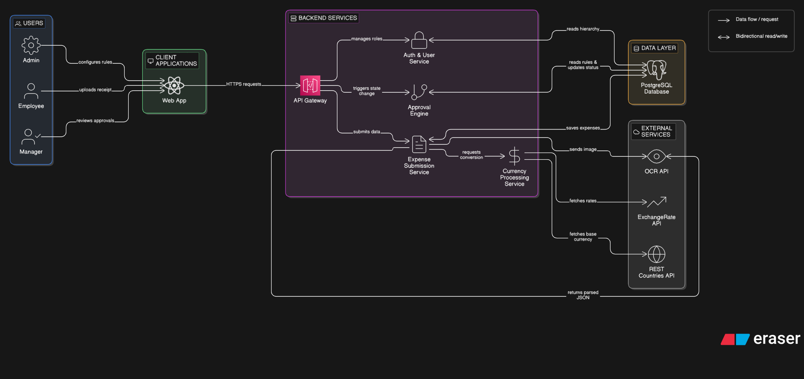

# ODOOXVIT

## Project Overview
This repository contains the `ODOOXVIT` project.

## Project Structure
- `prd.md`: Product Requirements Document
- `.gitignore`: Files and directories to be ignored by Git (including internal agent/GSD files)

## Development
This project incorporates AI-assisted development (GSD/Antigravity).
The files for the AI agents are excluded from the main repository.

## System Architecture

> **Note:** Please manually save the architecture diagram image to the root folder as `system-architecture.png` to display it here.

The application follows a modular architecture divided into four primary layers:

### 1. Users & Client Application
- **Actors**: **Admin** (configures rules), **Employee** (uploads receipts), **Manager** (reviews approvals).
- **Client App**: A React-based Web App that communicates with the backend via HTTPS requests.

### 2. Backend Services
- **API Gateway**: The central entry point that routes client requests to respective internal microservices.
- **Auth & User Service**: Manages user roles and reads organizational hierarchies.
- **Approval Engine**: Handles state changes by reading Admin-configured rules and updating expense statuses dynamically.
- **Expense Submission Service**: Handles the core logic of saving expenses, orchestrating image parsing, and requesting conversions.
- **Currency Processing Service**: A dedicated service abstracting real-time exchange rates and base currencies.

### 3. Data Layer
- **PostgreSQL Database**: A centralized relational database storing the hierarchy, approval rules, and expense records.

### 4. External Services
- **OCR API**: Parses receipt images and strictly returns parsed JSON (e.g., Mindee or Tesseract).
- **ExchangeRate API**: Provides live foreign exchange rates.
- **REST Countries API**: Fetches default country-based currencies during initial onboarding.

